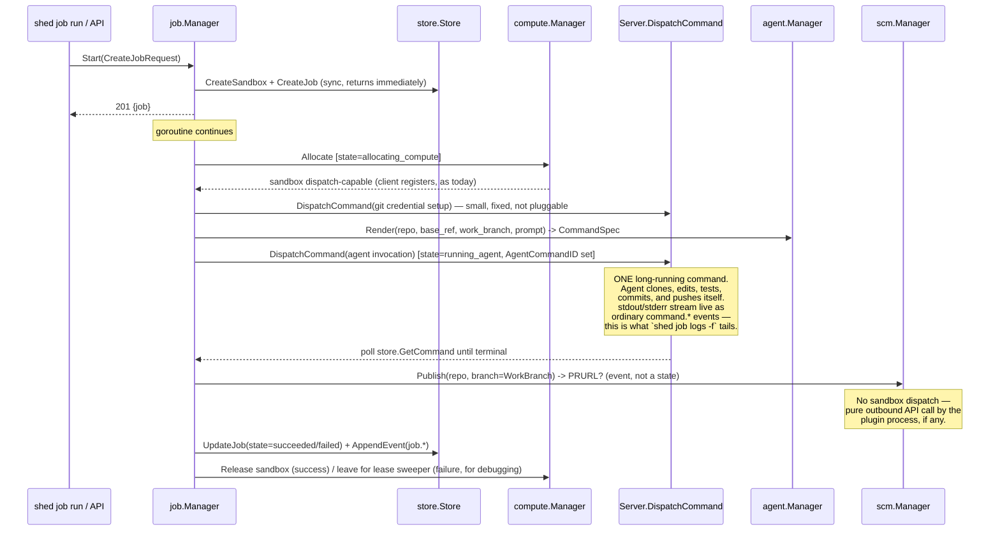

# Software Factory Plan

## Context

Shed is currently a sandbox control plane: a compute-class/driver plugin system (HashiCorp go-plugin/gRPC, external processes, versioned `compute.v1` lifecycle), sandbox/session/command state machines, an append-only per-sandbox event log, and a hand-written embedded UI — all single-binary, stdlib-heavy, sane-defaults-first (`docs/single-binary-architecture.md`, `docs/compute-plugins.md`, `PLAN-plugin-system.md`).

The goal is to add the layer that turns "I can run commands in a sandbox" into "I can hand Shed a repo + a prompt and get a pushed branch back." This plan went through two reframes before landing here:

1. Compared against Warp's Oz (a fleet-of-cloud-agents product: agents get full tool access and drive clone/edit/test/commit/push themselves over one long session; the primary UX is a live, joinable, fleet-wide view, not a step tracker) — the workflow moved from "Shed authors prepare/verify/publish commands around a dumb agent call" to **the agent owns the whole workflow; Shed only allocates, provisions credentials, and observes**.
2. Pushed further toward minimalism ("small, light, but extensible factory") — every field/state that doesn't change Shed's own behavior got cut. A Job is now the smallest record that can (a) name a pluggable agent/SCM driver and (b) point at the one sandbox Command that's actually doing the work.
3. Added a **Nomad-style CLI as a first-class observability surface**, not an afterthought behind the UI. Since the whole job API is HTTP already, the CLI is a thin wrapper over it — and because that API is complete after milestone 1, the CLI ships early and becomes the primary tool for verifying every later milestone, the same way `nomad job status`/`nomad logs` are how you'd actually watch a Nomad job rather than reading raw HTTP.

This still reuses the existing sandbox/command/event machinery rather than inventing parallel execution primitives.

## Approach

### Key architectural insight (verified against the current code)

A job's real work — clone, edit, test, commit, push — happens **inside one long-running sandbox `Command`** running the agent binary (e.g. `claude -p "<assembled prompt>"`) with full shell/file access to the workspace. That command is dispatched through the exact same path every other command in Shed already uses: `store.CreateCommand` then either `cc.send("command.start", ...)` to a connected websocket client or `execViaCompute` for exec-capable drivers (`internal/server/server.go:466-502`). Because `Runner.stream` already forwards stdout/stderr chunks live as `command.stdout`/`command.stderr` events the instant they're produced (`internal/client/runner.go:85-97`), "join a live agent session" is not new infrastructure — it's the existing command-output event stream, consumed two ways: the UI's reused Run-tab component, and a CLI command that tails the same events.

Two corrections verified against the actual code, both load-bearing for the rest of this plan:

- **Events** are stored strictly keyed by `sandbox_id` (`internal/store/memory.go:27`); `ListSandboxEvents` requires the sandbox to exist. So a Job owns one dedicated Sandbox from creation (created synchronously in `Start`, exactly like `server.createAndAllocateSandbox` creates the Sandbox row before compute `Allocate` runs — `server.go:209-229`). Every job-level event is `store.AppendEvent(ctx, job.SandboxID, "", "server.job", ...)`. `GET /v1/jobs/{id}/events` is a thin proxy: look up `job.SandboxID`, call `ListSandboxEvents`. No `model.Event` schema change, no second event index.
- **Command dispatch needs `Server`, not just `store`**: `store.CreateCommand` alone only inserts a row; the actual dispatch (websocket send vs. `execViaCompute`) is private logic in `server.go`. `internal/job` needs exactly one extraction: `Server.DispatchCommand(ctx, sandboxID string, in store.CommandCreate) (model.Command, error)`, pulled out of `createCommand` (lines 466-502).

`AgentDriver` stays pluggable/external-process-capable (mirrors Oz's own "route across Claude Code/Codex/Warp Agent interchangeably"); `ScmDriver` is deliberately thin — since the agent pushes its own branch, the built-in driver is a no-op, and the interface is a pure outbound API call (PR creation) with no sandbox access, not a `CommandSpec`.

### Boiling it down: what got cut

None of these change what Shed itself does — each was either derivable, agent-owned, or a knob with no current use:

| Cut | Why |
|---|---|
| `VerifyCommands []string` as a structured `Job`/`RenderRequest` field | It only ever became prompt text ("run `go test ./...` before you're done"). The caller writes that directly into `Prompt`. |
| `JobPublishing` as its own `JobState` | `Publish` is a fast, no-sandbox outbound call. It's an event pair (`job.publish.started`/`succeeded`/`failed`) during the `running_agent → succeeded` transition, not a durable state with its own row/UI badge. |
| `WorkDir` as a configurable `Job`/`RenderRequest` field | Fixed as a convention (`/workspace/repo`, always). Add it back only when something actually needs to vary it. |
| A separate prepare/verify pipeline with its own dispatched commands | Folded into the agent's own tool-calling loop (clone/test are steps *in the prompt*, not steps Shed's state machine tracks). |
| Front-loading a shared `internal/pluginhost` abstraction | `agent`/`scm` duplicate `compute`'s plugin-transport boilerplate directly; consolidate only once three concrete copies exist and the shape is undeniable. |

### Resulting model

```go
// internal/model/model.go
type JobState string
const (
    JobQueued            JobState = "queued"
    JobAllocatingCompute JobState = "allocating_compute"
    JobRunningAgent      JobState = "running_agent"
    JobSucceeded         JobState = "succeeded"
    JobFailed            JobState = "failed"
    JobCancelled         JobState = "cancelled"
)

type JobTrigger struct {
    Source      string `json:"source"`       // "manual" for v1; "webhook"/"slack"/... reserved for later
    Actor       string `json:"actor,omitempty"`
    ExternalRef string `json:"external_ref,omitempty"`
}

type Job struct {
    ID             string
    Repo           string
    BaseRef        string
    WorkBranch     string
    Prompt         string
    ComputeClass   string
    AgentDriver    string
    ScmDriver      string
    SandboxID      string
    AgentCommandID string // the one long-running command; CLI/UI "session" view attaches to this
    State          JobState
    FailureReason  string `json:"failure_reason,omitempty"`
    Trigger        JobTrigger
    Result         JobResult
    Metadata       map[string]string
    InsertedAt, UpdatedAt time.Time
}

type JobResult struct {
    Branch   string `json:"branch,omitempty"`
    PRURL    string `json:"pr_url,omitempty"`
    PRNumber int    `json:"pr_number,omitempty"`
}
```

Six states total, one of which (`allocating_compute`) is pure infrastructure and one of which (`running_agent`) covers the entire agent-owned workflow. `AgentCommandID` is the one field the CLI/UI need to know which command to "join."

### Flow



### Interfaces

```go
// internal/agent — the important pluggable boundary (Shed's answer to Oz's
// "route across Claude Code/Codex/Warp Agent interchangeably")
type CommandSpec struct { Command, Cwd string; Env map[string]string; TimeoutMS int64 }
type RenderRequest struct {
    APIVersion, SandboxID, Repo, BaseRef, WorkBranch, Prompt string
    Config map[string]any
}
type RenderResponse struct { Command CommandSpec; Metadata map[string]string }
type AgentV1 interface {
    Info(context.Context) (PluginInfo, error)
    Render(context.Context, RenderRequest) (RenderResponse, error)
}

// internal/scm — thin, no sandbox access; the agent already pushed the branch
type PublishRequest struct { APIVersion, SandboxID, Repo, Branch string; Config map[string]any }
type PublishResponse struct { PRURL string; PRNumber int; Metadata map[string]string }
type ScmV1 interface {
    Info(context.Context) (PluginInfo, error)
    Publish(context.Context, PublishRequest) (PublishResponse, error)
}
```

Both mirror `internal/compute`'s builtin/external resolution shape (`internal/compute/manager.go:395-476`) and plugin transport (`internal/compute/plugin.go`) — duplicated per package rather than factored into a shared `internal/pluginhost` yet (see cuts table). Built-in `cli` agent driver assembles a prompt that explicitly instructs the full workflow — clone `Repo` into the fixed workdir at `BaseRef`, create `WorkBranch`, do `Prompt`, commit, and push — and renders it into one `claude -p "<assembled prompt>" ...` invocation; the driver only *renders*, `job.Manager` calls `DispatchCommand`. Built-in `scm` driver is a no-op (`PublishResponse{}`); an external GitHub/GitLab plugin makes its own outbound API call using credentials from its own `ExternalPluginConfig.Env`.

Leaves room for a future `agent.v2`/`Drive(ctx, req, sink) error` streaming contract for a richer embedded-harness driver (e.g. targeting Pi's agent harness), without redesigning `agent.v1` — matches the project's existing versioning rule ("future API versions should coexist... instead of changing it in place", `docs/compute-plugins.md:36`).

### CLI (Nomad-shaped)

The primary observability surface, not a UI afterthought: a thin HTTP client + `noun verb` command router, the same shape as `nomad job status`/`nomad job run`/`nomad logs`/`nomad job stop`. Talks only to the real HTTP API (never a store/in-process shortcut) — same discipline as agent/scm drivers — so it works identically against a local `shed dev` and a remote `shed server`.

- `shed job run -repo=... -base-ref=main -prompt="..." [-compute-class=] [-agent-driver=] [-scm-driver=]` → `POST /v1/jobs`.
- `shed job status` (no args) → table (`ID STATE REPO BRANCH AGENT AGE`) via stdlib `text/tabwriter`, like `nomad job status`.
- `shed job status <job_id>` → detail: repo/branch/state/failure reason/sandbox id/agent command id/result/trigger/timestamps.
- `shed job logs <job_id> [-f]` → fetches `job.AgentCommandID`, streams `command.stdout`/`command.stderr` for that command via SSE, writing raw `chunk` text — reads like a real terminal tail.
- `shed job stop <job_id>` → `POST /v1/jobs/{id}/cancel`.
- `-shed-addr`/`SHED_ADDR` selects the API base URL, default `http://127.0.0.1:6464`, mirroring `-address`/`NOMAD_ADDR`.
- Color-coded state (green/red/yellow) via `github.com/fatih/color` (already resolved transitively via `go-plugin`'s `hclog`, so promoting it to a direct dependency is free); degrades to plain text off-TTY / `NO_COLOR`.

Because the job API's wire shape is finished at the end of milestone 1, the CLI is built right after it and used, unmodified, to verify milestones 2 and 3.

## Files to modify

New:
- `internal/job/` — `Manager`, state machine, `CommandDispatcher` interface.
- `internal/agent/` — `AgentV1`, manager, plugin transport (`agent.v1`), built-in `cli` driver.
- `internal/scm/` — `ScmV1`, manager, plugin transport (`scm.v1`), built-in no-op driver.
- `pkg/agent/`, `pkg/scm/` — public SDK aliases, mirroring `pkg/compute/compute.go`.
- `internal/apiclient/` — thin HTTP client (`CreateJob`, `ListJobs`, `GetJob`, `CancelJob`, `StreamJobEvents`).
- `internal/cli/` — `job.go` (run/status/logs/stop), later `sandbox.go`/`compute.go`.
- `docs/software-factory.md` — lifecycle, plugin authoring, CLI usage, config, security notes.

Modified:
- `internal/model/model.go` — add `Job`, `JobState`, `JobTrigger`, `JobResult`.
- `internal/store/store.go`, `internal/store/memory.go` — add `CreateJob`/`ListJobs`/`GetJob`/`UpdateJob` to the `Store` interface, mirroring the Sandbox CRUD block (`store.go:40-45`).
- `internal/server/server.go` — extract `Server.DispatchCommand` from `createCommand` (lines 466-502); add `jobMgr *job.Manager` field + `SetJobManager`; add `POST/GET /v1/jobs`, `GET /v1/jobs/{id}`, `POST /v1/jobs/{id}/cancel`, `GET /v1/jobs/{id}/events`.
- `internal/config/config.go` — add `Agents`/`Scm` config sections structurally identical to `ComputeConfig`/`ExternalPluginConfig` (`config.go:15-24`).
- `cmd/shed/main.go` — `-agent-driver`/`-agent-plugin`/`-scm-driver`/`-scm-plugin` flags + `SHED_AGENT_PLUGINS`/`SHED_SCM_PLUGINS` env vars, reusing the existing `pluginConfigFlag` type; add `case "job": err = cli.RunJob(ctx, os.Args[2:])` to the top-level dispatch; wire construction order (`srv := server.New(...)` then `jobMgr := job.NewManager(...)` then `srv.SetJobManager(jobMgr)`).
- `internal/ui/dist/index.html`, `internal/ui/dist/app.js` — Jobs as landing view (milestone 4).
- `go.mod` — promote `github.com/fatih/color` from indirect to direct.

## Reuse

Existing code and patterns to preserve, not reinvent:
- `server.createAndAllocateSandbox` (`server.go:209-229`) — the "create the row before allocation completes" pattern a Job's own `Start` copies so `SandboxID` exists from the first event.
- `server.createCommand` / `execViaCompute` (`server.go:466-514`) — the only dispatch path; extraction target for `Server.DispatchCommand`.
- `internal/server/server_test.go:197-210` — the poll-`store.GetCommand`-until-terminal idiom `job.Manager` reuses for every dispatched command.
- `internal/compute/manager.go:395-476` (`resolve`/`startExternal`) — the builtin/external plugin resolution shape `agent.Manager`/`scm.Manager` copy.
- `internal/compute/plugin.go` — the go-plugin/gRPC handshake/adapter template to duplicate for `agent.v1`/`scm.v1`.
- `internal/compute/local.go` (`LocalCompute`) — precedent that even in-process built-ins drive the sandbox through the same protocol/command path as external ones, not a backdoor; the reason `AgentDriver`/`ScmDriver` never get direct store access.
- `internal/client/runner.go:85-97` (`Runner.stream`) — already streams stdout/stderr live as `command.*` events; this is what makes `shed job logs -f` and the UI session tab possible with zero new sandbox-side code.
- `server.releaseSandbox` (`server.go:354-373`) — the two calls (`compute.Manager.Release` + `store.UpdateSandboxState(released)`) a succeeded job reuses to clean up its sandbox.
- `server.leaseSweeper` (`server.go:231-257`) — already reclaims abandoned sandboxes; a failed/cancelled job deliberately leaves its sandbox for this instead of adding new cleanup code, so a human can inspect it first.
- `pkg/compute/compute.go` — the public SDK alias pattern for `pkg/agent`/`pkg/scm`.
- `docs/compute-plugins.md` — structure and versioning rule to mirror in `docs/software-factory.md`.

## Steps

### Milestone 1 — Job skeleton + full CLI
- [ ] Add `model.Job`, `model.JobState` (six states), `model.JobTrigger`, `model.JobResult` to `internal/model/model.go`.
- [ ] Add `CreateJob`/`ListJobs`/`GetJob`/`UpdateJob` to `store.Store` + `MemoryStore`, mirroring the Sandbox CRUD block.
- [ ] Extract `Server.DispatchCommand(ctx, sandboxID string, in store.CommandCreate) (model.Command, error)` out of `createCommand`, with a typed `ErrClientNotConnected`; make `createCommand` a thin wrapper.
- [ ] Add `internal/job` package: `Manager`, `CommandDispatcher` interface, `Config`, `Start`/`Cancel`, in-memory per-job `context.CancelFunc` map.
- [ ] Implement the state machine end-to-end with a stub "agent" step (e.g. `sleep 1 && echo done`, no real `agent`/`scm` packages yet): `queued → allocating_compute → running_agent → succeeded/failed/cancelled`, releasing the sandbox on success and leaving it for the lease sweeper on failure/cancel.
- [ ] Add `Server.SetJobManager` + `POST /v1/jobs`, `GET /v1/jobs`, `GET /v1/jobs/{id}`, `POST /v1/jobs/{id}/cancel`, `GET /v1/jobs/{id}/events` (proxy to `ListSandboxEvents` via `job.SandboxID`).
- [ ] Wire construction order in `cmd/shed/main.go` (`server.New` → `job.NewManager` → `srv.SetJobManager`) for both `server` and `dev` modes.
- [ ] Add `internal/apiclient`: `Client`, `CreateJob`, `ListJobs`, `GetJob`, `CancelJob`, `StreamJobEvents` (SSE via `bufio.Scanner`).
- [ ] Add `internal/cli/job.go`: `run`/`status`/`logs [-f]`/`stop`, `text/tabwriter` table output, `-shed-addr`/`SHED_ADDR`.
- [ ] Add `case "job":` to `cmd/shed/main.go`'s top-level dispatch.
- [ ] Unit tests: `internal/job` (fake `CommandDispatcher`, full happy-path state transition, cancel mid-flight), `internal/store` (Job CRUD), `internal/server` (new routes), mirroring `internal/compute/manager_test.go`/`internal/server/server_test.go` conventions.

### Milestone 2 — Real agent execution
- [ ] Add `internal/agent` package: `AgentV1`, `CommandSpec`/`RenderRequest`/`RenderResponse`, `Manager` (builtin/external resolution mirroring `compute.Manager`).
- [ ] Duplicate `internal/compute/plugin.go`'s go-plugin/gRPC adapter for `agent.v1` (own `MagicCookieKey`).
- [ ] Implement built-in `cli` driver: prompt assembly (repo/base_ref/work_branch/prompt → full workflow instructions) + `Render`.
- [ ] Add credential provisioning step in `job.Manager` (small fixed dispatched command; decide token sourcing here, threaded through `Config`/`Metadata`).
- [ ] Wire `running_agent` state to call `agent.Manager.Render` → `DispatchCommand`, record `Job.AgentCommandID`, poll to terminal.
- [ ] Add `Agents` config section (`internal/config/config.go`) + `-agent-driver`/`-agent-plugin`/`SHED_AGENT_PLUGINS`.
- [ ] Add `pkg/agent` SDK aliases.
- [ ] Verify manually with `shed job run` + `shed job logs -f` against a real (test fixture) repo — confirm a real clone/edit/push happens.

### Milestone 3 — Publish step
- [ ] Add `internal/scm` package: `ScmV1`, `PublishRequest`/`PublishResponse`, `Manager`.
- [ ] Duplicate the plugin transport for `scm.v1`.
- [ ] Implement built-in no-op driver.
- [ ] Wire the publish call as an event pair (`job.publish.started`/`succeeded`/`failed`) in the `running_agent → succeeded` transition (not a new `JobState`).
- [ ] Add `Scm` config section + `-scm-driver`/`-scm-plugin`/`SHED_SCM_PLUGINS`.
- [ ] Add `pkg/scm` SDK aliases.
- [ ] Document the external-plugin contract for PR creation (even though v1 ships no PR automation).

### Milestone 4 — Fleet dashboard UI
- [ ] Move default route/brand link to `#/jobs`; add Jobs to top nav ahead of Sandboxes/Compute.
- [ ] Add `view-jobs` list (State/Repo/Branch/Agent/Age), with list-level polling (`GET /v1/jobs`).
- [ ] Add job detail view reusing `renderDetailChrome`/`TABS`/`showTab`: `overview`, `session` (read-only Run-tab reuse attached to `job.AgentCommandID`), `events`.

### Milestone 5 — Docs
- [ ] Write `docs/software-factory.md` mirroring `docs/compute-plugins.md`: job lifecycle, agent/scm plugin authoring (Go skeletons), CLI usage, config, security notes (agent/scm plugins are operator-trusted binaries, same trust model as compute plugins; repo credentials are provisioned into the sandbox, not the plugin process, for the built-in driver).

### Future (not v1, tracked as follow-ups)
- [ ] Trigger sources (webhook/Slack) as new callers of `POST /v1/jobs` populating `Trigger.Source`.
- [ ] `agent.v2`/`Drive(ctx, req, sink) error` streaming contract for a richer embedded-harness driver (e.g. targeting Pi's agent harness), using Shed's existing command/file HTTP API as the harness's remote tool-execution surface.
- [ ] `shed sandbox status`/`shed compute status` CLI parity commands (cheap wrappers over already-existing GET endpoints).
- [ ] Consolidate `internal/compute`/`internal/agent`/`internal/scm`'s duplicated plugin-transport boilerplate into a shared `internal/pluginhost`, once the duplication is proven across all three.

## Verification

- `go test ./...` after each milestone.
- `mise run fmt`, `mise run build`.
- Manual end-to-end, CLI-first: `mise run run:dev:once`, then `shed job run -repo=... -base-ref=main -prompt="..."`, `shed job status` (watch `queued → allocating_compute → running_agent → succeeded`), `shed job logs -f <id>` while it runs, and confirm the branch was actually pushed (check the remote/test fixture repo, not just Shed's own state).
- UI (milestone 4): open `http://127.0.0.1:6464/ui/`, confirm it lands on Jobs, create a job, and watch the session tab stream the same output `shed job logs -f` shows — while a second job runs concurrently, to confirm the fleet list updates for both.
